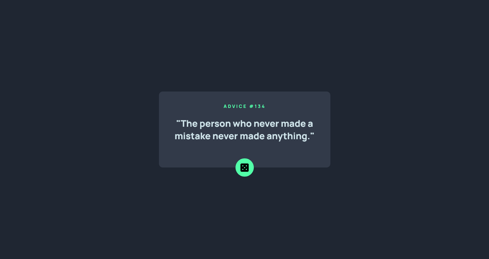
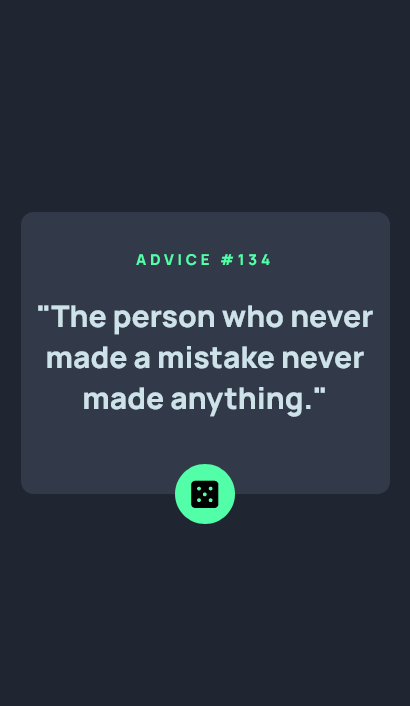

# Frontend Mentor - Advice generator app solution

This is a solution to the [Advice generator app challenge on Frontend Mentor](https://www.frontendmentor.io/challenges/advice-generator-app-QdUG-13db). Frontend Mentor challenges help you improve your coding skills by building realistic projects.

## Table of contents

- [Overview](#overview)
  - [The challenge](#the-challenge)
  - [Screenshot](#screenshot)
  - [Links](#links)
- [My process](#my-process)
  - [Built with](#built-with)
  - [What I learned](#what-i-learned)
  - [Continued development](#continued-development)
  - [Useful resources](#useful-resources)
- [Author](#author)
- [Acknowledgments](#acknowledgments)

## Overview

### The challenge

Users should be able to:

- View the optimal layout for the app depending on their device's screen size
- See hover states for all interactive elements on the page
- Generate a new piece of advice by clicking the dice icon

### Screenshot





### Links

- Solution URL: [Add solution URL here](https://github.com/snowrlax/Advice-Generator-App)
- Live Site URL: [Add live site URL here](https://polite-dolphin-a5a145.netlify.app/)

## My process

### Built with

- Semantic HTML5 markup
- CSS custom properties
- Flexbox
- CSS Grid
- Mobile-first workflow

### What I learned

I learned what are API's and how do they work, I got to know about the slip api, async await and javascript promises, i also got to know about the mobile screen ratios and the ratios used for making responsive websites and their compatibility with browsers.  

```css

@media screen and (max-width: 480px) {
    .container{
        min-width: 200px;
        max-width: 90%;
        min-height: 40% ;
    }

    
}
```
```js
function getNewAdvice() {
    fetch(url).then(response => {
        return response.json();
    }).then(adviceData => {
        const adviceObj = adviceData.slip;
        text.innerHTML = `<p id="adviceTxt">"${adviceObj.advice}"</p>`;
        id.innerHTML = `<p id="adviceID">ADVICE #${adviceObj.id}</p>`;
        console.log(adviceObj);
    }).catch(error => {
        console.log(error);
    });
}

```

### Continued development

I will continue to focus on how to work with api's and how to deal with promises and async functions, i will try to make use of more intresting api's like twillio api and mailchimp api. I will also be using bootstrap to make my projects look more responsive over mobile devices and desktop alike. 

### Useful resources

- [Async Functions](https://developer.mozilla.org/en-US/docs/Web/JavaScript/Reference/Statements/async_function) - This helped me learn async functions. I really liked this MDN website and will use it going forward.
- [Javascript Promises](https://developer.mozilla.org/en-US/docs/Web/JavaScript/Reference/Global_Objects/Promise) - This is an amazing article which helped me understand javascript promises. I'd recommend it to anyone still learning this concept.

## Author

- Website - [Add your name here](https://www.github.com/snowrlax)
- Frontend Mentor - [@yourusername](https://www.frontendmentor.io/profile/snowrlax)
- Twitter - [@yourusername](https://www.twitter.com/prnviskidding)

