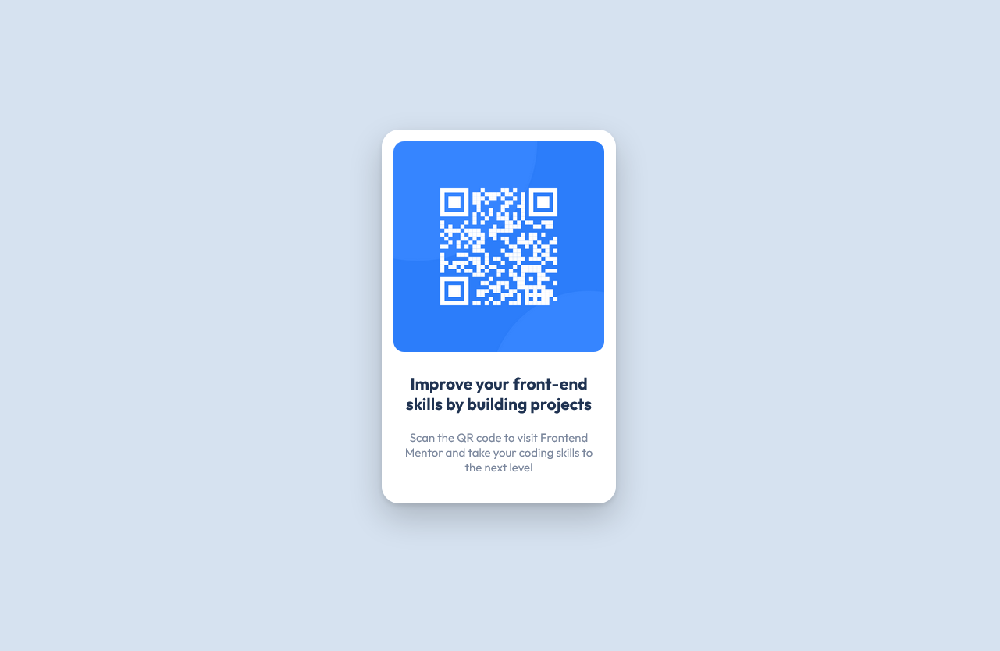

# Frontend Mentor - QR code component solution

This is a solution to the [QR code component challenge on Frontend Mentor](https://www.frontendmentor.io/challenges/qr-code-component-iux_sIO_H). Frontend Mentor challenges help you improve your coding skills by building realistic projects. 

## Table of contents

- [Overview](#overview)
  - [Screenshot](#screenshot)
  - [Links](#links)
- [My process](#my-process)
  - [Built with](#built-with)
  - [What I learned](#what-i-learned)
  - [Continued development](#continued-development)
  - [Useful resources](#useful-resources)
- [Author](#author)
- [Acknowledgments](#acknowledgments)

**Note: Delete this note and update the table of contents based on what sections you keep.**

## Overview

### Screenshot




### Links

- Solution URL: [URL here](https://github.com/snowrlax/FrontendMentor_Challenges/tree/main/qr-code-component-main)
- Live Site URL: [Live site URL here](https://62e7e053a0215453636e76e5--quiet-biscuit-d60c73.netlify.app/)

## My process

### Built with

- Semantic HTML5 markup
- CSS custom properties
- Google fonts


### What I learned

I recalled all the basics i've learned so far and i had put them to use. This was a very good refresher of HTML, CSS. I took my time to figure
out things and i tried to make it as similar as it looked in the challenge picture.


I stuggled with box-shadow a little and then i looked it up, this box-shadow is a generated one, although i and understand it.
```css
.card {
  box-shadow: rgba(0, 0, 0, 0.2) 0px 12px 28px 0px, rgba(0, 0, 0, 0.1) 0px 2px 4px 0px, rgba(255, 255, 255, 0.05) 0px 0px 0px 1px inset;
}
```

### Continued development

I am still struggling with minor alignments and CSS Grid. I tried inspecting my code as many times as i can and it helped me resolve the problem i was having 

### Useful resources

- [Box shadow generator](https://getcssscan.com/css-box-shadow-examples) - This helped me with box shadow which i could not wrap my head around. I really liked the box shadow styles and will use it going forward.
- [Making Image responsive](https://www.freecodecamp.org/news/how-to-center-an-image-in-css/) - This is an amazing article which helped me finally how to make image responsive inside a card. I'd recommend it to anyone still learning this concept.

## Author

- Website - [Pranav](https://github.com/snowrlax)
- Frontend Mentor - [@yourusername](https://www.frontendmentor.io/profile/yourusername)
- Twitter - [@pranviskidding](https://www.twitter.com/pranviskidding)

